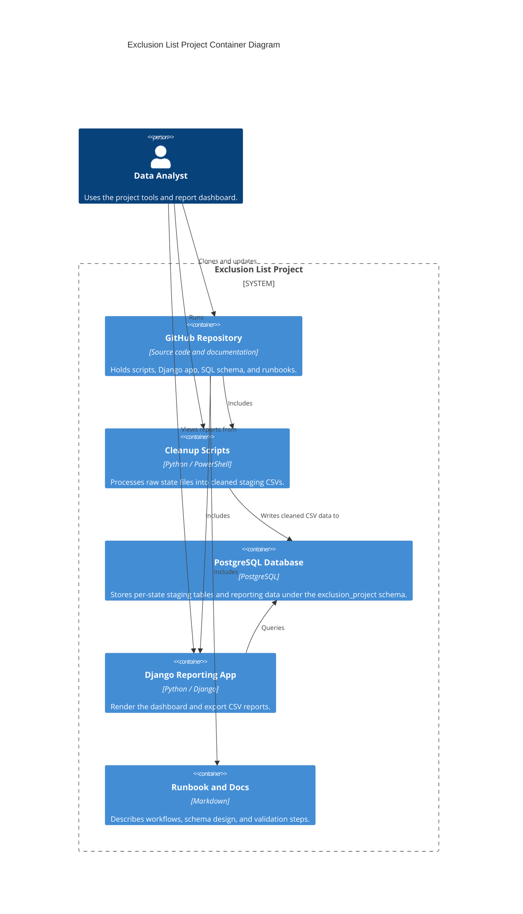

# C4 Container Diagram

This page describes the primary containers that make up the Exclusion List Project.

```mermaid
C4Container
    title Exclusion List Project Container Diagram

    Person(dataAnalyst, "Data Analyst", "Uses the project tools and report dashboard.")

    System_Boundary(project, "Exclusion List Project") {
        Container(codeRepo, "GitHub Repository", "Source code and documentation", "Holds scripts, Django app, SQL schema, and runbooks.")
        Container(cleanPipeline, "Cleanup Scripts", "Python / PowerShell", "Processes raw state files into cleaned staging CSVs.")
        Container(postgresDb, "PostgreSQL Database", "PostgreSQL", "Stores per-state staging tables and reporting data under the exclusion_project schema.")
        Container(djangoApp, "Django Reporting App", "Python / Django", "Render the dashboard and export CSV reports.")
        Container(docs, "Runbook and Docs", "Markdown", "Describes workflows, schema design, and validation steps.")
    }

    Rel(dataAnalyst, codeRepo, "Clones and updates")
    Rel(dataAnalyst, cleanPipeline, "Runs")
    Rel(dataAnalyst, djangoApp, "Views reports from")
    Rel(cleanPipeline, postgresDb, "Writes cleaned CSV data to")
    Rel(djangoApp, postgresDb, "Queries")
    Rel(codeRepo, docs, "Includes")
    Rel(codeRepo, cleanPipeline, "Includes")
    Rel(codeRepo, djangoApp, "Includes")
```