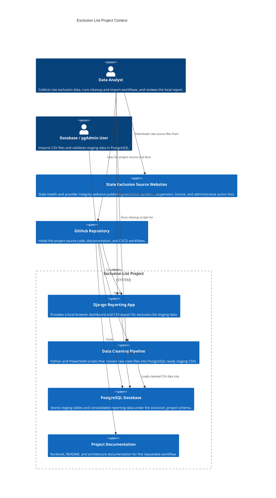

# C4 Context Diagram

This page documents the high-level context for the Exclusion List Project.

```mermaid
C4Context
    title Exclusion List Project Context

    Person(dataAnalyst, "Data Analyst", "Collects raw exclusion data, runs cleanup and import workflows, and reviews the local report.")
    Person(dbAdmin, "Database / pgAdmin User", "Imports CSV files and validates staging data in PostgreSQL.")
    System(stateSource, "State Exclusion Source Websites", "State health and provider integrity websites publishing exclusion, sanction, suspension, license, and administrative action lists.")
    System(githubRepo, "GitHub Repository", "Holds the project source code, documentation, and CI/CD workflows.")

    System_Boundary(project, "Exclusion List Project") {
        System(djangoReport, "Django Reporting App", "Provides a local browser dashboard and CSV export for exclusion-list staging data.")
        System(cleanPipeline, "Data Cleaning Pipeline", "Python and PowerShell scripts that convert raw state files into PostgreSQL-ready staging CSVs.")
        System(database, "PostgreSQL Database", "Stores staging tables and consolidated reporting data under the exclusion_project schema.")
        System(documents, "Project Documentation", "Runbook, README, and architecture documentation for the repeatable workflow.")
    }

    Rel(dataAnalyst, stateSource, "Downloads raw source files from")
    Rel(dataAnalyst, cleanPipeline, "Runs cleanup scripts for")
    Rel(dataAnalyst, djangoReport, "Uses to view exclusion reports in")
    Rel(dbAdmin, database, "Connects to")
    Rel(djangoReport, database, "Reads from")
    Rel(cleanPipeline, database, "Loads cleaned CSV data into")
    Rel(githubRepo, cleanPipeline, "Hosts")
    Rel(githubRepo, djangoReport, "Hosts")
    Rel(githubRepo, documents, "Hosts")
    Rel(dataAnalyst, githubRepo, "Uses for project source and docs")
```